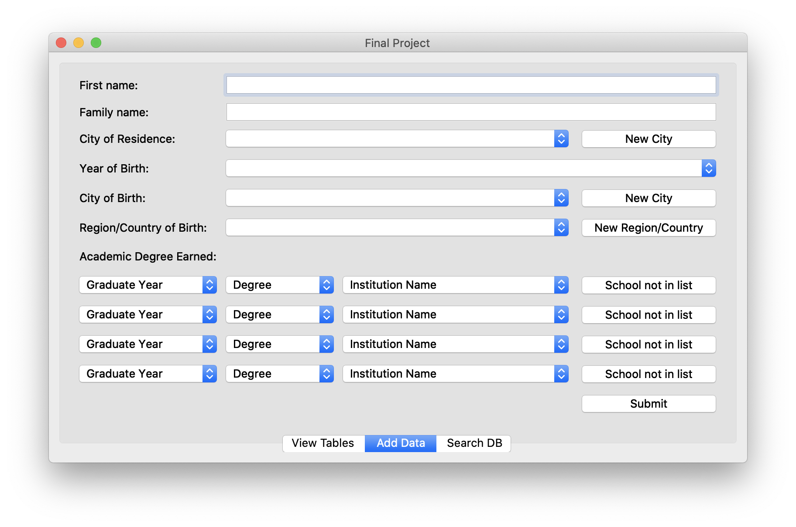
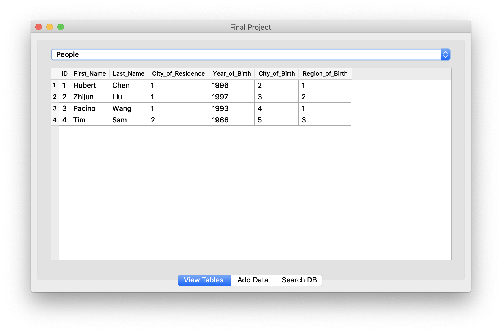
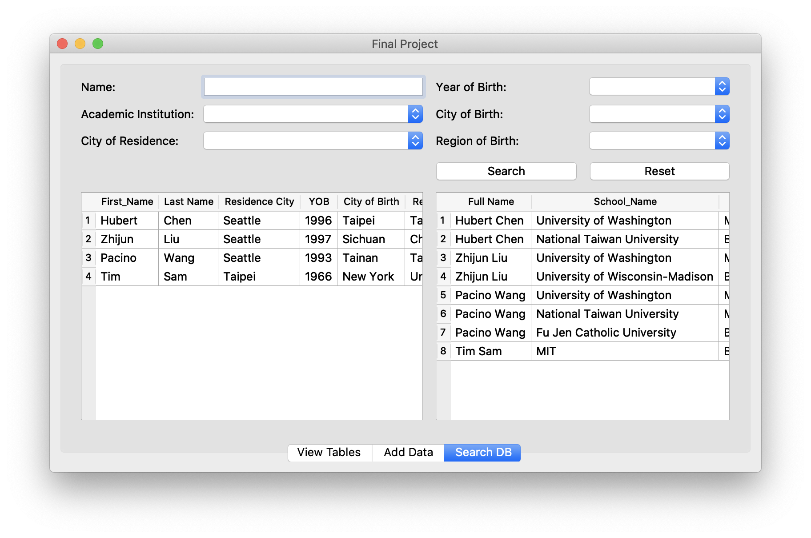

# python_app

This is a small project using `PyQt5` and `SQLite` to buid an application for entering and storing data.

### Add Data
The Add Data tab is designed for inputting data. Information in this window covers all tables connected to the database, including Fist Name, Last Name, City of Residence, Year of Birth, City of Birth and academic record information. All the blanks except for academic record are required. If the required information is missing or no database is connected, a corresponding warning message will pop up.

### View Tables
All the tables in the database are accessible in the View Table tab. When a user submitted new data, the new info can be viewed directly in this tab.

### Search DB
There are two table display windows in the Search DB tab. By selecting filters list above, users can look up the corresponding record in the database.

### File Menu
There are three operation available In the File Menu: Open File, Disconnect to the Database, and Close the Application.
